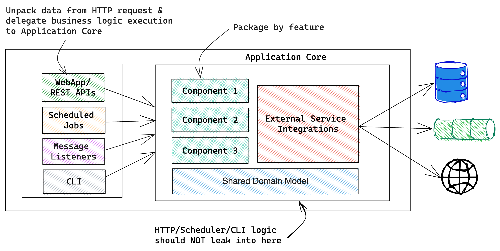

**Tomato Architecture** is an approach to software architecture following **Common Sense Manifesto**

**Read Blog Post:** [Tomato Architecture - A Pragmatic Approach to Software Design](https://www.sivalabs.in/tomato-architecture-pragmatic-approach-to-software-design/)

## Common Sense Manifesto
* Think what is best for your software over blindly following suggestions by popular people.
* Strive to keep things simple instead of over-engineering the solution by guessing the requirements for the next decade.
* Do R&D, pick a technology and embrace it instead of creating abstractions with replaceability in mind.
* Make sure your solution is working as a whole, not just individual units.

## Architecture Diagram



## Implementation Guidelines

### 1. Package by feature
A common pattern to organize code into packages is by splitting based on technical layers such as controllers, services, repositories, etc.
If you are building a Microservice which is already focusing on a specific module or business capability, then this approach might be fine.

If you are building a monolith or modular-monolith then it is strongly recommended to first split by features instead of technical layers.

For more info read: https://phauer.com/2020/package-by-feature/

### 2. Keep "Application Core" independent of delivery mechanism (Web, Scheduler Jobs, CLI)
The Application Core should expose APIs that can be invoked from a main() method.
In order to achieve that, the "Application Core" should not depend on its invocation context.
Which means the "Application Core" should not depend on any HTTP/Web layer libraries.
Similarly, if your Application Core is being used from Scheduled Jobs or CLI then 
any Scheduling logic or CLI command execution logic should never leak into Application Core.

### 3. Separate the business logic execution from input sources (Web Controllers, Message Listeners, Scheduled Jobs etc)

The input sources such as Web Controllers, Message Listeners, Scheduled Jobs, etc should be a thin layer extracting the data 
from request and delegate the actual business logic execution to "Application Core".

**DON'T DO THIS**

```java
@RestController
class CustomerController {
    private final CustomerService customerService;
    
    @PostMapping("/api/customers")
    void createCustomer(@RequestBody Customer customer) {
       if(customerService.existsByEmail(customer.getEmail())) {
           throw new EmailAlreadyInUseException(customer.getEmail());
       }
       customer.setCreateAt(Instant.now());
       customerService.save(customer);
    }
}
```

**INSTEAD, DO THIS**

```java
@RestController
class CustomerController {
    private final CustomerService customerService;
    
    @PostMapping("/api/customers")
    void createCustomer(@RequestBody Customer customer) {
       customerService.save(customer);
    }
}

@Service
@Transactional
class CustomerService {
   private final CustomerRepository customerRepository;

   void save(Customer customer) {
      if(customerRepository.existsByEmail(customer.getEmail())) {
         throw new EmailAlreadyInUseException(customer.getEmail());
      }
      customer.setCreateAt(Instant.now());
      customerRepository.save(customer);
   }
}
```

With this approach, whether you try to create a Customer from a REST API call or from a CLI,
all the business logic is centralized in Application Core.

**DON'T DO THIS**

```java
@Component
class OrderProcessingJob {
    private final OrderService orderService;
    
    @Scheduled(cron="0 * * * * *")
    void run() {
       List<Order> orders = orderService.findPendingOrders();
       for(Order order : orders) {
           this.processOrder(order);
       }
    }
    
    private void processOrder(Order order) {
       ...
       ...
    }
}
```

**INSTEAD, DO THIS**

```java
@Component
class OrderProcessingJob {
   private final OrderService orderService;

   @Scheduled(cron="0 * * * * *")
   void run() {
      List<Order> orders = orderService.findPendingOrders();
      orderService.processOrders(orders);
   }
}

@Service
@Transactional
class OrderService {

   public void processOrders(List<Order> orders) {
       ...
       ...
   }
}
```

With this approach, you can decouple order processing logic from scheduler 
and can test independently without triggering through Scheduler.

### 4. Don't let the "External Service Integrations" influence the "Application Core" too much
From the Application Core we may talk to database, message brokers or 3rd party web services, etc.
Care must be taken such that business logic executors not heavily depend on External Service Integrations.

For example, assume you are using Spring Data JPA for persistence, and 
from your **CustomerService** you would like fetch customers using pagination. 

**DON'T DO THIS**

```java
@Service
@Transactional
class CustomerService {
   private final CustomerRepository customerRepository;

   PagedResult<Customer> getCustomers(Integer pageNo) {
      Pageable pageable = PageRequest.of(pageNo, PAGE_SIZE, Sort.of("name"));
      Page<Customer> cusomersPage = customerRepository.findAll(pageable);
      return convertToPagedResult(cusomersPage);
   }
}
```

**INSTEAD, DO THIS**

```java
@Service
@Transactional
class CustomerService {
   private final CustomerRepository customerRepository;

   PagedResult<Customer> getCustomers(Integer pageNo) {
      return customerRepository.findAll(pageNo);
   }
}

@Repository
class JpaCustomerRepository {

   PagedResult<Customer> findAll(Integer pageNo) {
      Pageable pageable = PageRequest.of(pageNo, PAGE_SIZE, Sort.of("name"));
      return ...;
   }
}
```

This way any persistence library changes will only affect repository layer only.

### 5. Keep domain logic in domain objects
If you have domain object state change methods that affect only that object or a method to calculate something 
from the state of the object, then those methods belong to that domain object.

**DON'T DO THIS**

```java

class Cart {
    List<LineItem> items;
}

@Service
@Transactional
class CartService {

   CartDTO getCart(UUID cartId) {
      Cart cart = cartRepository.getCart(cartId);
      BigDecimal cartTotal = this.calculateCartTotal(cart);
      ...
   }
   
   private BigDecimal calculateCartTotal(Cart cart) {
      ...
   }
}
```

**INSTEAD, DO THIS**

```java

class Cart {
    List<LineItem> items;

   public BigDecimal getTotal() {
      ...
   }
}

@Service
@Transactional
class CartService {

   CartDTO getCart(UUID cartId) {
      Cart cart = cartRepository.getCart(cartId);
      BigDecimal cartTotal = cart.getTotal();
      ...
   }
}
```

### 6. No unnecessary interfaces
Don't create interfaces with the hope that someday we might add another implementation for this interface.
If that day ever comes, then with the powerful IDEs we have now it is just a matter of extracting the interface in a couple of keystrokes.

If the reason for creating an interface is for testing with Mock implementation, 
we have mocking libraries like Mockito which is capable of mocking classes without implementing interfaces.

So, unless there is a good reason, don't create interfaces.

### 7. Embrace the framework's power and flexibility
Usually, the libraries and frameworks are created to address the common requirements that are required for majority of the applications.
So, when you choose a library/framework to build your application faster, then you should embrace it.

Instead of leveraging the power and flexibility offered by the selected framework, 
creating an indirection or abstraction on top of the selected framework with the hope 
that someday you might switch the framework to a different one is usually a very bad idea.

For example, Spring Framework provides declarative support for handling database transactions, caching, method-level security etc.
Introducing our own similar annotations and re-implementing the same features support 
by delegating the actual handling to the framework is unnecessary.

Instead, it's better to either directly use the framework's annotations or compose the annotation with additional semantics if needed.

```java
@Target(ElementType.TYPE)
@Retention(RetentionPolicy.RUNTIME)
@Documented
@Transactional
public @interface UseCase {
   @AliasFor(
        annotation = Transactional.class
   )
   Propagation propagation() default Propagation.REQUIRED;
}
```

### 8. Test not only units, but whole features

We should definitely write unit tests to test the units(business logic), by mocking external dependencies if required.
But it is more important to verify whether the whole feature is working properly or not.

Even if our unit tests are running in milliseconds, can we go to production with confidence? Of course not.
We should verify the whole feature is working or not by testing with the actual external dependencies such as database or message brokers.
That gives us more confidence.

I wonder this whole idea of "We should have core domain completely independent of external dependencies" philosophy
came from the time when testing with real dependencies is very challenging or not possible at all.

Luckily, we have better technology now (ex: [Testcontainers](https://testcontainers.com/)) to test with real dependencies.
Testing with real dependencies might take slightly more time, but compared to the benefits, that's a negligible cost.

## FAQs
1. **What's with the name "Tomato"?**
   
   If you are okay with "Hexagonal" knowing 6 edges has no significance, you should be okay with "Tomato".
   After all, we have Onion Architecture, why not Tomato:-)

2. **What if they call me "code monkey" for following this architecture?**

    Ignore them. Focus on delivering the business value.